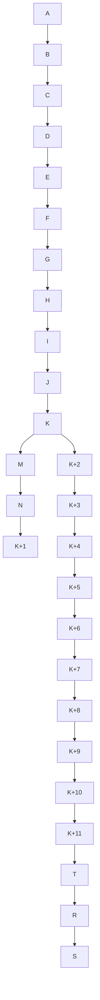

# 🥋 SumoGame – Project Context & Roadmap
**Version:** 2025 Master Plan  
**Maintainer:** Superhero Tony  
**Last Updated:** 2025-10-23  
**Baseline:** v0.3.x (Vite Build — Sprints A–K Complete)

---

## 🎮 Core Vision

A self-contained, offline-playable sumo management and simulation game built for deterministic, replayable tournaments and rich narrative flavor.

### Core Pillars
1. **Always Playable** – every build boots, renders, and simulates with seeded demo data.
2. **Deterministic Sim** – identical outcomes for identical seeds (debug + replay friendly).
3. **ZIP-First Delivery** – all builds playable locally (`index.html` or `Start Game.command`).
4. **Layered Simulation** – weekly ticks, basho cycles, world events, stable progression.
5. **Expandable Content** – drop-in Ink (inkjs) packs, flavor/name packs, and future expansions.

---

## 🧱 Tech Stack Overview

| Layer | Technology | Purpose |
|-------|-------------|----------|
| UI/Frontend | **React + Vite + Tailwind + Radix UI** | Modern, lightweight UI & theming |
| Game Logic | **TypeScript (Zustand + Immer)** | Deterministic world + sim core |
| Data | **Dexie.js (IndexedDB)** | Durable local saves, offline |
| Randomness | **seedrandom** | Reproducible RNG streams |
| Validation | **Zod** | Schemas, save migration, event safety |
| Bundling | **Vite** | Fast dev server + production build |
| Compression | **JSZip + pako** | Export/import save compression |
| Background Tasks | **Web Worker + comlink** | Non-blocking sim ticks |
| Audio | **howler.js** | Optional ambient effects |
| Charts | **recharts** | Match stats, economy KPIs |
| Search | **fuse.js** | Fuzzy lookup for rikishi, heya, news |
| Names & Flavor | **@faker-js/faker** | Shikona, heya, region lexicons |
| Narrative | **Ink (inkjs)** | Council & storylets (text-driven) |
| IDs | **nanoid** | Short collision-safe unique IDs |
| Dates | **date-fns** | Weekly/monthly/basho date math |
| Hotkeys | **hotkeys-js** | Quick controls for sim actions |

---

## 🧭 Always Playable Rules (applied to all builds)

1. **Boot Guarantee** — `index.html` always loads without a dev server.
2. **Seeded Demo Data** — if no save found, auto-seed a sample world.
3. **Safe UI** — disabled or incomplete features show a tooltip or stub modal.
4. **Feature Flags** — “Coming Soon” panels replace incomplete screens.
5. **Error Boundaries** — friendly fallback (“Back to Dashboard”) for crashes.
6. **Offline Mocking** — Dexie + fake data ensures all screens populate.
7. **ZIP Packaging Check** — Start scripts self-validate before shipping.

---

## 📦 Sprint Roadmap (Recalibrated 2025)

| Sprint | Build | Focus / Deliverables | Status |
|:--|:--|:--|:--|
| **A** | Full | Core UI, routing, theme, base layout | ✅ |
| **B** | Full | World engine, heya/rikishi entities, shikona gen v1 | ✅ |
| **C** | Delta | Simulation core (training, bouts) | ✅ |
| **D** | Delta | Governance (council mock, rules registry) | ✅ |
| **E** | Delta | Rivalries & scouting | ✅ |
| **F** | Delta | UI/UX polish, icons, light/dark | ✅ |
| **G** | Delta | Global theming & error boundaries | ✅ |
| **H** | Full | Persistence + time controls (save/load, autosave) | ✅ |
| **I** | Delta | AI trades, rivalry evolution, dynamic world events | 🚧 |
| **J** | Full | Event feed, calendar scaffolding, skip controls | ✅ |
| **K** | Full | Basho engine, standings, 82 kimarite table | ✅ |
| **L** | Delta | Achievements & progression | 🔜 |
| **M** | Full | Baseline consolidation (A–L) | ✅ (v0.3.x baseline) |
| **N** | Delta | FTUE (player/heya creation, start flow) | ✅ |
| **O** | Delta | Look-through metrics & rollups | 🔜 |
| **P** | Delta | Commentary system & tone shifts | 🔜 |
| **Q** | Delta | Economy & sponsorships | 🔜 |
| **T** | Full | Year in Review & Career recap | 🔜 |
| **R** | Full | Modularization (core/web/contracts split) | 🔜 |
| **S** | Delta | UI/UX polish (Radix polish, transitions, icons) | 🔜 |

---

## 🔧 K+ Extension Track (Post-K Tech & System Deltas)

| Sprint | Build | Theme / Focus | Key Additions |
|:--|:--|:--|:--|
| **K+1** | Delta | Feature flags & FTUE hooks | Persistent flags, resuming FTUE |
| **K+2** | Delta | Dynamic standings | Live standings feed + fallbacks |
| **K+3** | Delta | Calendar & skip polish | Stop-at-basho, cancel/resume fixes |
| **K+4** | Delta | Live sim bridge | Push bout results into feed |
| **K+5** | Delta | Prehook + golden tests | Reproducible sim runs |
| **K+6** | Delta | Deterministic RNG + schemas | seedrandom + Zod + nanoid + date-fns |
| **K+7** | Delta | Dexie saves + export/import | IndexedDB + JSZip/pako + migrations |
| **K+8** | Delta | Workerized sim | Web Worker + comlink |
| **K+9** | Delta | Search, charts, audio | fuse.js, recharts, howler.js |
| **K+10** | Delta | Content packs | faker + Ink (inkjs) storylet packs |
| **K+11** | Delta | Storage polish & hotkeys | Dexie compression, hotkeys-js |

---

## 🧩 Feature Dependency Graph (Simplified)

---

## 📘 Developer Notes

- **Baseline Save Schema (v1.0)** → Rikishi, Heya, World, Basho, Matches, Rivalries, Finances.  
- **Seeded RNG Streams:** `rng('basho')`, `rng('training')`, `rng('names')`.  
- **Storage Migration Path:** LocalStorage → Dexie v1 → Dexie v2 (compressed).  
- **Ink Integration:** Council panels, newsletters, flavor events (via event bus).  
- **Testing:** Vitest for logic; golden logs for determinism; Playwright for FTUE/UI.  
- **CI/CD:** Builds both static + Vite ZIPs; runs preflight (boot + seed check).  

---

## 🚀 Next Deliverable

**Sprint K+6 (Determinism & Schemas Delta)**
- Add `seedrandom` RNG wrapper.
- Introduce Zod schemas for saves/events.
- Integrate `nanoid` and `date-fns`.
- Validate and migrate existing saves.
- Verify identical outcomes across seeds.

---

_This document defines the canonical development and delivery sequence for SumoGame going forward.  
All future ZIPs and deltas will adhere to the “Always Playable” guarantee._
